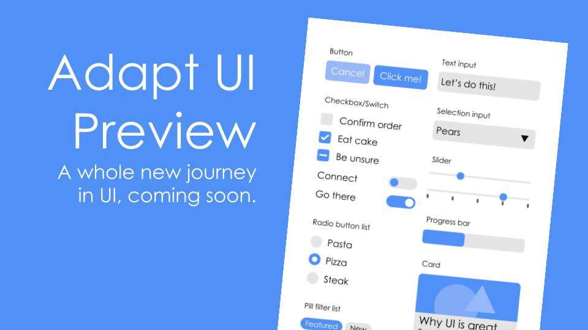

# Adapt UI
Adapt UI, the user interface design language by LiveG Technologies.

Want to see how good it looks? [Try out our live demo!](https://opensource.liveg.tech/Adapt-UI/tests/all/build/tech.liveg.opensource.allTests-0.1.0.html)

<div align="center">
    
    <p>Designers: We're busily compiling a guide for Adapt UI and its specifications. It will be available soon!</p>
</div>

## Using Adapt UI
To use Adapt UI, you'll need [Zapr](https://github.com/LiveG-Development/Zapr) installed ─ Zapr is a tool made by LiveG that allows you to integrate libraries with ease and package your apps into single, standalone HTML files.

In your script file for your project, you'll need the following Zapr directive line:

```javascript
// @import https://opensource.liveg.tech/Adapt-UI/src/ui.js
```

If you want to include the `AppLayout` model to create a proper app layout (including headers, sidebar menus and dialogs), you'll need the following Zapr line too:

```javascript
// @import https://opensource.liveg.tech/Adapt-UI/src/models/applayout/model.js
```

You'll also need to include the basic structure that makes up the skeleton of your app's UI design as shown in our [Hello](https://opensource.liveg.tech/Adapt-UI/tests/hello/build/tech.liveg.opensource.hello-0.1.0.html) example ─ [the source code is on GitHub](https://github.com/LiveG-Development/Adapt-UI/tree/master/tests/hello) and is also open-source.

When you need to build and test your project, just run these commands in your app's directory:

```bash
$ zapr build app
$ zapr serve
```

You can then go to [http://127.0.0.1:5000](http://127.0.0.1:5000) to test your project.

In addition to building apps with Adapt UI, you can also build static sites (with optional help from Zapr). Just include the following lines in your HTML page:

```html
<link rel="stylesheet" href="https://opensource.liveg.tech/Adapt-UI/src/imports.css">
<link rel="stylesheet" href="https://opensource.liveg.tech/Adapt-UI/src/style.css">
```

## Contributing to Adapt UI
Adapt UI is open-source and is subject to the licence terms in the [LiveG Open-Source Licence](LICENCE.md). That means that you can use Adapt UI on your projects, and adapt (pardon the pun) it into whatever you want!

To test Adapt UI, go to your terminal and go to one of the test directories (for example `tests/all`) and type:

```bash
$ zapr build app
$ zapr serve
```

You can then see the results on [http://127.0.0.1:5000](http://127.0.0.1:5000).

> **Note:** For LiveG employees who have push access to this repository and if the demos are built correctly, you should see your changes on [opensource.liveg.tech](https://opensource.liveg.tech).
